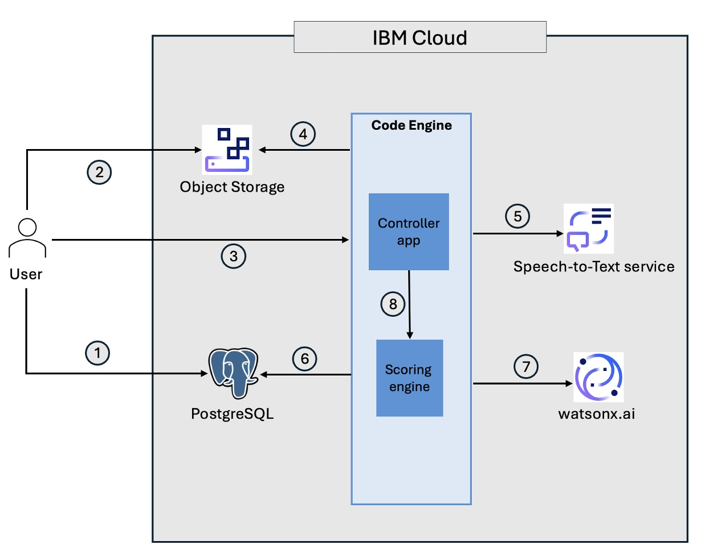
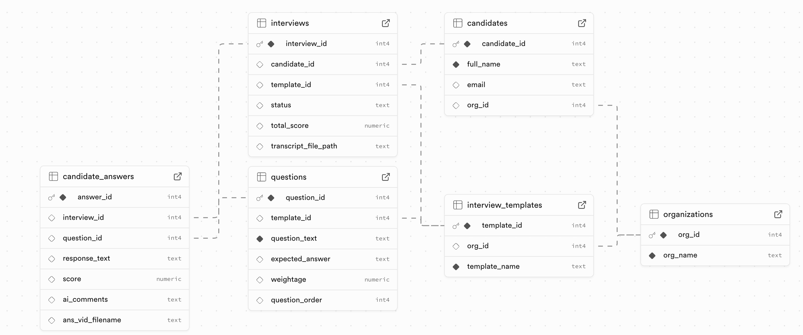

# IBM UDAO Interview scorer

## Overview
This artifact is a Scouting Services and Assessment Services that matches potential candidates to the potential employers;  based on matching candidate's skills with the skills needed for the job position; using AI services so that they can shorten the time to market with enhanced features for the user "organization"

The solution uses watsonx to analyze the candidate interview video content, converted to text, and score the candidate based on the responses to the questions. For scoring expected answers provided are used by  this solutions. The interview video is converted to audio file and then to text. watsonx.ai analyses the text and provides a score based on actual answers and expected answers.

## Technology Used 
watsonx.ai: is used to analyze interview transcript based on questions and expected answers. It scores each answer based on weightage given to questions by hiring organizations.

Cloud Object Storage: Interview video recordings are made available in IBM Cloud Object Storage.

IBM PostgreSQL: Questions and expected answers are stored in PostgreSQL database

watson Speech to Text service: is used to convert the audio extracted from the candidate interview video

IBM Code Engine: is used as runtime for custom applications that integrate with watsonx.ai, watson Speech to Text service, Cloud Object Storage and database services

## Architecture diagram


1. User stores questions, expected answers, role etc. in database
2. User stores interview video file in IBM Cloud Object Storage (CoS)
3. User triggers workflow using custom application (Controller app) on IBM Cloud Code Engine
4. The Controller app retrieves the interview video file stores in CoS, extracts audio from it
5. The Controller app passes the audio file to IBM Speech-to-Text service to get the text transcription of the interview
6. The Controller app gets the set of questions, weightage for each question and expected answers from PostgreSQL database
7. IBM watsonx.ai is used to:
    7.1 Match questions and answers
    7.2 Score answers based on expected answer
8. For each question, compute score based on answer score and question weightage. Also compute overall score.

## Folder Structure
```
ANYWAI-IBM-MVP/
│
├── backend/                         # Backend application
│   ├── routers/                     # API route definitions
│   │   ├── db_router.py             # Integration with Supabase database
│   │   └── score_interview.py       # Score candidate answer using watsonx.ai models
│   │   └── transcriber.py           # Helps with transcribing interview video file to text
│   │   └── vid_to_stt.py            # Convert video to audio to text
│   │
│   ├── tests/                       
│   │   ├── local_test.py            # File to test locally on dev env
│   │
│   ├── main.py                      # Main FastAPI/Flask entry point
│   ├── logger_config.py             # Logging configuration
│   ├── local_test.py                # Local test runner or quick script
│   ├── Dockerfile                   # Docker image definition for backend
│   ├── requirements.txt             # Backend Python dependencies
│
├── data/                            # Database schema and sample data
│   ├── db_schema.sql                # SQL DDL – table creation scripts
│   ├── Sample_data_Insert_SQL.sql   # SQL DML – sample data insert scripts
│   ├── db-schema.jpg                # ER diagram or schema visualization
│   └── README.md                    # Optional – describe data sources
│
├── docs/                            # Documentation and diagrams
│   ├── Architecture_Diagram.jpg     # High-level system architecture
│   └── README.md                    # Optional – explanation of architecture
│
├── docker-compose.yml               # Docker orchestration (services, DB, backend, etc.)
├── README.md                        # Root-level overview of project
└── local_test.py                    # Top-level quick test file (if not part of backend)
```

## Setup and run

### Pre-requisites
- IBM Cloud account
- IBM watsonx.ai runtime service
- watsonx Orchestrate instance
- Code Engine
- Speech to Text service instance on IBM Cloud
- Object Storage instance on IBM Cloud
- Docker Engine
- Supabase account
- IBM Cloud CLI - https://cloud.ibm.com/docs/cli?topic=cli-getting-started


### Database schema


### Existing setup required
This MVP relies on some of the existing interview data already being available in database and also interview video files available in Object storage. 

The interview video files should be available in Object storage. Name these files in some logical way.
The Supabase database tables (interview_templates, candidates, questions, interviews) should be populated with the initial interview details. You may use data/Sample_data_Insert_SQL.sql file to load a sample set of data.


### Gather configuration information

- Clone/download the GitHub repo
- Refer to .env_template file. Gather the following information:
    - watsonx API Key and URL - https://www.ibm.com/docs/en/watsonx/w-and-w/2.2.0?topic=tutorials-generating-api-keys
    - Supabase url and Supabase key - https://supabase.com/docs/guides/api#api-url-and-keys
    - Object Storage details - https://cloud.ibm.com/docs/cloud-object-storage?topic=cloud-object-storage-service-credentials
    - Watson Speech to Text service - https://cloud.ibm.com/docs/speech-to-text?topic=speech-to-text-gettingStarted

### Steps to install applications
#### 1. Create file with environment variables
- Create a new file named .env file in `backend` folder.
- Copy all the variables from .env_template file to .env file.
- Enter values for all the variables using the data that you gathered in the section `Gather configuration information`
- Save the .env file.

#### 2. Deploy applications to Code Engine
There are two applications that should be deployed to application.
1. Backend application (/backend)
2. Frontend application (/frontend)
- Use https://cloud.ibm.com/docs/codeengine?topic=codeengine-getting-started#app-hello to deploy the applications to IBM Cloud Code engine.
- Make a note of the backend application url.
- Update the backend application url in environment variables of frontend application.

##### 2.2 Deploy frontend react application
<Jainam to update this section>

### Run the application
Open the application url for frontend application in a browser.

<Jainam to explain, with screenshots, how application can be used>